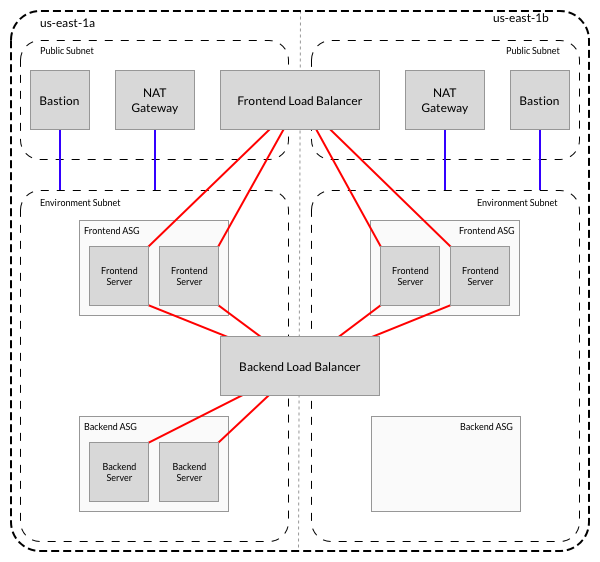

# Octan Demo

[](https://travis-ci.org/coderanger/octan_demo)
[](https://www.apache.org/licenses/LICENSE-2.0)

This repository is an example of using Terraform and Chef to build a multi-tier
web application in AWS.

## Quickstart

Make sure you [have Terraform installed](https://www.terraform.io/downloads.html),
available via `brew install terraform` if you use a Mac and have Homebrew set up.

```bash
$ git clone https://github.com/coderanger/octan_demo.git
$ cd octan_demo
$ make get apply
```

Unfortunately Terraform sometimes hangs after standing up a lot of objects at
once, so you may have to Ctrl-C out of it and re-run `make apply` until it
completes. Once it is finished, Terraform will display the URLs for the
staging and production services respectively.

## The Overall Design



We're using a new VPC and the `a` and `b` availability zones of the configured
region (`us-east-1` by default). In each AZ we set up three subnets: `public`,
`staging`, and `production`.

The `public` subnet in each AZ holds a NAT gateway for the two private subnets
in that zone, a bastion host to allow SSHing to internal hosts for debugging,
and two frontend load balancers (one each for `staging` and `production`).

The `staging` and `production` subnets in each zone contain a frontend server
cluster (as an Auto-Scaling Group), a backend application cluster. Additionally
the `staging` and `production` subnets contain a backend load balancer shared
between both availability zones.

Infrastructure is built using Terraform, a declarative/convergent system for
specifying AWS objects (and more, but this only using AWS). All servers are
configured using Chef. Chef is run in serverless mode, using policy archives
uploaded to S3. Avoiding the use of a Chef Server keeps the example more
self-contained and makes it easier to run the demo, at the cost of a more
complex cookbook distribution layer.

## Frontend Servers

Each frontend server uses Nginx to serve static content. All requests that do
not match static files are forwarded to the backend load balancer for the
environment. Static files are downloads from S3 by Chef during machine
bootstrapping. Each frontend cluster ASG is configured to use 1-2 machines, for
a total of 2-4 servers per environment to ensure redundancy in case of server
failure or network outage.

## Backend Servers

Each backend server uses Tomcat to host a simple blog application. Due to the
use of an EBS volume for storing the application's data files, currently only
the `a` zone can run backend servers, so the cluster in the `a` zone is configured
to maintain two servers at all times while the other zone is scaled down to zero
servers.

As the provided application uses local files for storage and only supports a
single writer, redundancy is provided via a hot standby pair. Each environment
has an EBS volume used to store the blog data, and only the server that has
the volume attached is allowed to run Tomcat. The other server in the pair (or
both during initial set up) checks every 5 seconds to see if the volume is
available and if so tries to attach and mount it. This storage volume acts as
a mutex, ensuring only one of the servers becomes active at any given time.
During a failover, the volume will be marked available (either because the
server it was attached to has been removed or via manual detach) and whichever
server in the cluster attaches it first is allowed to become the primary. The
load balancer health checks see that the original primary is now down, and that
the new primary is accepting requests, and so moves traffic over. This process
requires about 60 seconds of downtime for a full failover.

## Folder Layout

* `cookbooks/` - Chef cookbooks for this project.
    * `octan_backend/` - Chef cookbook for deploying a backend server.
    * `octan_base/` - Chef cookbook for base platform config on all servers.
    * `octan_frontend/` - Chef cookbook for deploying a frontend server.
* `policies/` - Chef policies for the three types of servers.
* `policy_export/` - Contains exported Chef policies as a staging area before
  they are uploaded to S3.
* `tf/` - Terraform root module containing global objects shared by all availability
  zones.
    * `tf/chef/` - Terraform module for uploading Chef policy archives to S3.
    * `tf/octan_cluster/` - Terraform module for creating an application cluster.
    * `tf/octan_env/` - Terraform module for creating all the objects in an
     environment (eg. `production` or `staging`) in an availability zone.
    * `tf/octan_lb/` - Terraform module for creating a load balancer to be used
      later by an `octan_cluster` ASG.
    * `tf/octan_zone/` - Terraform module for creating all the objects in an
      availability zone.

## Problems

A few of the things that this example does not cover, or skips for brevity:

* Chef cookbooks are being uploaded to a public S3 file, which could be a
  disclosure problem.
* Nothing in this is using TLS due to the difficulty of provisioning certificates.
* Failover can require up to a minute of downtime.
* The included IAM policies are overly permissive, potentially allowing escalation
  attacks in a real infrastructure.
* Relatively manual service discovery between tiers, via Terraform interpolation.
* Bastion hosts are running as plain instances instead of ASGs so they will not
  be automatically restarted if Amazon "oopses" them.
* No warning is shown to users during backend downtime. This could be fixed with
  a more complex Nginx config to return a static warning if the backend service
  is not responding.
* No full-stack integration tests, only per-cookbook integration testing. This
  could be added with kitchen-terraform potentially, but is out of scope for this demo.

Several of these problems could be solved by using a more standard database
backend rather than local file storage.

## Logging In

To log in to either a frontend or backend server, you must first SSH to one of
the two bastion hosts. While there is one bastion host in each availability
zone, in most cases you can use either interchangably. If Amazon is having a
network outage such that inter-AZ networking is down, you will have to use the
bastion host in the zone of the zone of the server you are trying to reach.

You can find the bastion host IPs from either the output of `terraform apply` or
`terraform output`, and then log in using the provided SSH key:

```bash
$ ssh-add id_octan
$ ssh -A octan@<bastion host>
```

From there you can find the instance private IPs from the Amazon dashboard and
SSH to the desired machine.

## Editing Cookbooks

Pre-baked policy archives are provided for simplicity, but if you want to edit
and of the Chef code you will need to re-generate them. To do this, [ensure you
have ChefDK installed](https://downloads.chef.io/chef-dk/) and then run `make
policies` to rebuild the archives. You will also need to run `make apply` at
some point to upload the new archives to S3. To re-converge nodes you can either
delete them and let the ASG create new nodes or SSH to them and run `sudo run-
chef` to trigger a download-and-run cycle.

## Cleaning Up

When you are ready to clean up, run `make destroy`. This kills the crab.

## License

Copyright 2016, Noah Kantrowitz

Licensed under the Apache License, Version 2.0 (the "License");
you may not use this file except in compliance with the License.
You may obtain a copy of the License at

http://www.apache.org/licenses/LICENSE-2.0

Unless required by applicable law or agreed to in writing, software
distributed under the License is distributed on an "AS IS" BASIS,
WITHOUT WARRANTIES OR CONDITIONS OF ANY KIND, either express or implied.
See the License for the specific language governing permissions and
limitations under the License.
